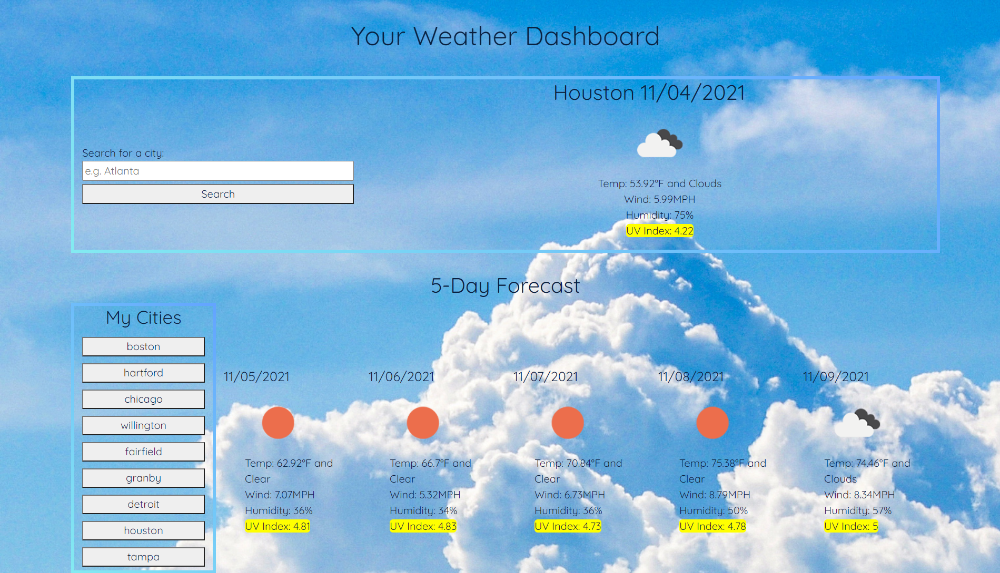

# Weather Dashboard

A simple weather app that shows current temperature, wind speed, humidity, and UVI, as well as a 5-day forecast for many different cities.
https://jtboyman.github.io/weather-dashboard/

## Description

Weather Dashboard uses the Open Weather API to fetch weather data for inputted cities. It also saves a list of past searches in order that allows a user to quickly access the weather for previously searched cities. The displayed information give current temperature, wind speed, humidity, and UVI (color coded based on severity), and a 5-day forecast with the same information for that city. The app also uses moment.js for date/time information.

## Preview

## Usage
Simply type the name of the city you'd like information for and press enter/click search. Your cities will be saved to a clickable list to search again.

## Roadmap

Looking forward to adding the following features:

- Background that adapts to time of day or user selection
- Minor CSS updates (e.g. button styling, UV color styling)
- Better mobile compatibility/funcitonality for smaller screens
- Easily delete search history

## Contributing

Any input is appreciated via opening issues in GitHub.